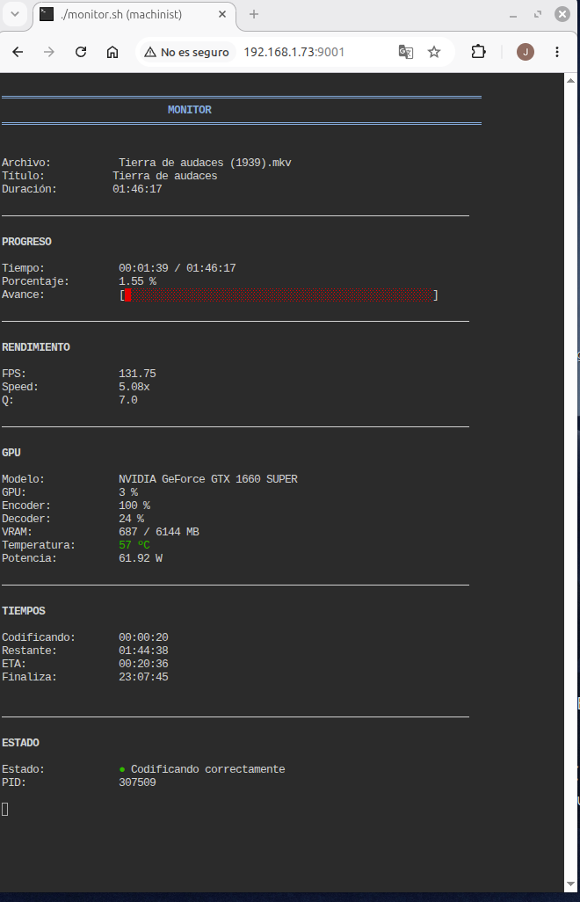

<h1 align="center">
  FFmpeg Auto Transcoder
</h1>

<p align="center">
Automatic movie transcoding using <b>FFmpeg</b> and <b>NVIDIA NVENC</b>.
</p>

<p align="center">


</p>

<p align="center">
  
</p>

---

Automatic movie transcoding service powered by **FFmpeg** and **NVIDIA NVENC**.

The application continuously monitors an **incoming** directory, automatically processes new movies, identifies them using **TMDb** and **OMDb**, transcodes them to H.265/HEVC, and organizes the final files into a structured media library.

Designed to run unattended on home servers, NAS systems and Linux workstations.

---

## Features

- 🎬 Automatic movie detection.
- 🚀 NVIDIA NVENC hardware acceleration.
- 📦 Automatic H.265 / HEVC transcoding.
- 📚 Automatic movie identification using TMDb and OMDb.
- 📁 Organized media library.
- 🌐 Real-time web monitor.
- ⚙️ Native Linux installer.
- 🐳 Docker Compose deployment.
- 🔄 Automatic service startup with systemd.
- 📝 Detailed logging.
- 🛡️ Automatic recovery if FFmpeg becomes unresponsive.

---

## Project Structure

```
ffmpeg-auto-transcoder/
├── transcoder.sh
├── monitor.sh
├── monitor-web.sh
├── install.sh
├── uninstall.sh
├── lib/
├── templates/
├── deploy/
│   └── docker/
└── README.md
```
## Requirements

### Native Installation

- Ubuntu 24.04 LTS (recommended)
- NVIDIA GPU with NVENC support
- NVIDIA proprietary drivers
- Internet connection (TMDb / OMDb)
- sudo privileges

The installer automatically installs the required packages:

- FFmpeg
- rsync
- jq
- curl
- bc
- ttyd

---

### Docker Compose

- Docker Engine 29 or later
- Docker Compose v2
- NVIDIA Container Toolkit
- NVIDIA proprietary drivers

The media library directory must be mounted as a Docker volume and be writable by the configured user (`PUID` / `PGID`).

---

## Supported Directory Structure

The application automatically creates and manages the following directories inside the media library:

```
MEDIA_DIR/
├── incoming/
├── processing/
├── library/
├── completed/
├── failed/
├── logs/
└── temp/
```

Simply copy new movies into the **incoming** directory and the transcoder will process them automatically.

## Native Installation

Clone the repository:

```bash
git clone https://github.com/mcjmm1-git/ffmpeg-auto-transcoder.git

cd ffmpeg-auto-transcoder
```

Make the installer executable:

```bash
chmod +x install.sh
```

Run the installer:

```bash
sudo ./install.sh
```

The installer will:

- Install all required dependencies.
- Create the media library directory structure.
- Copy the application to `/opt/ffmpeg-auto-transcoder`.
- Generate the configuration files.
- Install and enable the systemd services.
- Start the transcoder and the web monitor.

---

### Installed Services

```text
transcoder.service
ffmpeg-monitor.service
```

Check their status:

```bash
sudo systemctl status transcoder.service

sudo systemctl status ffmpeg-monitor.service
```

Restart the services:

```bash
sudo systemctl restart transcoder.service

sudo systemctl restart ffmpeg-monitor.service
```

Stop the services:

```bash
sudo systemctl stop transcoder.service

sudo systemctl stop ffmpeg-monitor.service
```

---

### Uninstall

To completely remove the application:

```bash
sudo ./uninstall.sh
```

The uninstaller lets you choose whether to preserve or remove:

- Configuration files
- Media library

## Docker Compose

Go to the Docker deployment directory:

```bash
cd deploy/docker
```

Create your personal configuration file:

```bash
cp .env.example .env
```

Edit the configuration:

```bash
nano .env
```

Configure the following values:

- `PUID`
- `PGID`
- `HOST_MEDIA`
- `TMDB_API_KEY`
- `OMDB_API_KEY`

You can obtain your user and group IDs with:

```bash
id
```

Example:

```text
uid=1000(john) gid=1000(john) groups=1000(john)
```

---

### Build and Start

Build the image and start the container:

```bash
docker compose up -d --build
```

To start the container again after the first build:

```bash
docker compose up -d
```

---

### View the Logs

```bash
docker compose logs -f
```

---

### Stop the Container

```bash
docker compose down
```

---

### Docker Configuration

The default transcoding parameters are defined directly in:

```text
deploy/docker/docker-compose.yml
```

You can easily customize values such as:

- Target movie size
- Minimum movie duration
- Minimum video bitrate
- Output resolution (4K, 1440p, 1080p, 720p)

Every option is documented inside the file.

## Configuration

The application stores all transcoding settings in a single configuration file.

### Native Installation

```text
/etc/ffmpeg-auto-transcoder/config.sh
```

### Docker Compose

Configuration is provided through:

- `.env`
- `docker-compose.yml`

---

### TMDb and OMDb API Keys

Movie identification requires API keys from both services.

Create a free account and obtain your personal keys:

- TMDb: https://www.themoviedb.org/settings/api
- OMDb: https://www.omdbapi.com/apikey.aspx

Without these keys, movies cannot be automatically identified or renamed.

---

### Media Library

The application expects the following directory structure:

```text
MEDIA_DIR/
├── incoming/
├── processing/
├── library/
├── completed/
├── failed/
├── logs/
└── temp/
```

Simply copy a movie into the **incoming** directory.

The transcoder will automatically:

1. Detect the new file.
2. Move it to `processing`.
3. Identify the movie.
4. Transcode it to HEVC (H.265).
5. Store the final movie inside `library`.
6. Move the original file to `completed`.

If an error occurs, the original file is moved to `failed`.

---

### Output Resolution

The output resolution can be configured in `docker-compose.yml` or `config.sh`.

Supported examples:

| Resolution | Width | Height |
|------------|------:|-------:|
| 4K UHD     | 3840 | 2160 |
| 1440p      | 2560 | 1440 |
| Full HD    | 1920 | 1080 |
| HD         | 1280 | 720 |

The transcoder automatically preserves the original aspect ratio while scaling and padding the image when necessary.

## Web Monitor

The application includes a built-in web monitor that displays the current transcoding status in real time.

During an active transcode, the monitor shows:

- Current movie
- Detected title
- Progress percentage
- Progress bar
- Elapsed time
- Remaining time (ETA)
- Current FPS
- Encoder quality
- NVIDIA GPU utilization
- GPU encoder usage
- GPU decoder usage
- GPU memory usage
- GPU temperature
- GPU power consumption
- FFmpeg process ID

---

### Native Installation

The monitor is available at:

```text
http://SERVER_IP:9001
```

Example:

```text
http://192.168.1.100:9001
```

---

### Docker Compose

Expose port **9001** in your `docker-compose.yml`:

```yaml
ports:
  - "9001:9001"
```

Then access the monitor from your browser:

```text
http://SERVER_IP:9001
```

---

### When No Movie Is Being Processed

If the transcoder is idle, the monitor displays:

- Service status
- GPU information
- Media library location
- Number of pending movies
- Helpful commands for managing the service

The display refreshes automatically, providing a live overview of the system status without requiring any manual intervention.

## How It Works

The transcoder continuously monitors the `incoming` directory for new movie files.

When a new file is detected, the following workflow is executed automatically:

```text
incoming
    │
    ▼
processing
    │
    ├── Movie identification (TMDb / OMDb)
    ├── Video analysis (FFprobe)
    ├── Hardware transcoding (NVENC)
    ├── Progress monitoring
    └── Error detection
    │
    ▼
library
    │
    ▼
completed
```

If the transcoding process fails for any reason, the original movie is moved to:

```text
failed/
```

---

## Hardware Acceleration

The application uses NVIDIA NVENC hardware acceleration whenever supported by the installed GPU.

Features include:

- H.265 / HEVC encoding
- Automatic GPU utilization monitoring
- Encoder utilization monitoring
- Automatic fallback for incompatible filters
- Detection of stalled FFmpeg processes
- Automatic recovery from encoding failures

---

## Logging

Detailed logs are stored in:

```text
MEDIA_DIR/logs/
```

These logs are useful for troubleshooting failed transcodes and reviewing the processing history.

---

## Updating

To update the application:

```bash
git pull
```

### Native Installation

Run the installer again:

```bash
sudo ./install.sh
```

The installer updates the application while preserving your existing configuration.

### Docker Compose

Rebuild the image:

```bash
docker compose up -d --build
```

---

## License

This project is released under the **MIT License**.

You are free to use, modify and distribute this software in accordance with the terms of the license.

---

## Contributing

Contributions, bug reports and feature requests are always welcome.

If you find a bug or have an idea for improving the project, please open an issue or submit a pull request.

---

## Acknowledgements

This project would not be possible without the excellent work of:

- FFmpeg
- NVIDIA NVENC
- The Movie Database (TMDb)
- OMDb API
- ttyd

---

# FFmpeg Auto Transcoder

Automatically identify, transcode and organize your movie collection with NVIDIA GPU acceleration.

Enjoy! 🎬
