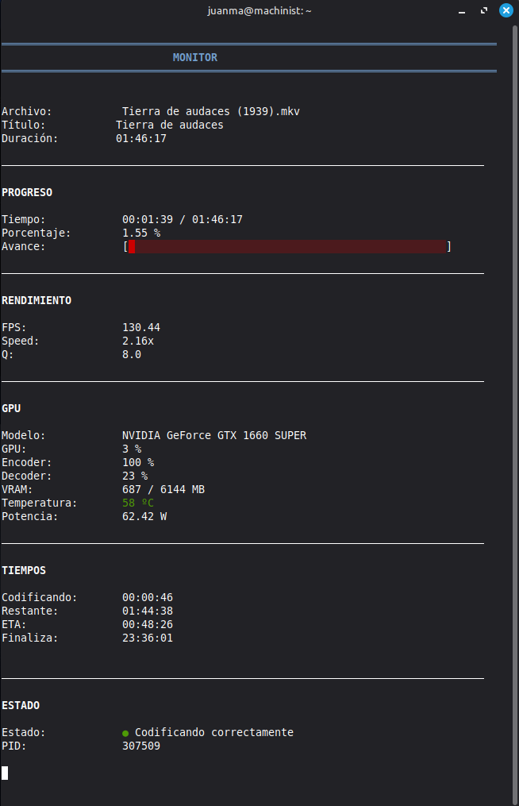

# FFmpeg Auto Transcoder for Jellyfin

Automatic movie transcoder for dedicated Jellyfin servers using FFmpeg, NVIDIA NVENC, TMDb, OMDb, and real-time monitoring.

> ⚠️ **Important**
>
> This project currently supports **NVIDIA GPUs with NVENC only**.
>
> **Intel Quick Sync (QSV)** and **AMD AMF** are **not supported** at this time.


---

## Overview

FFmpeg Auto Transcoder automatically monitors a movie library, transcodes new content using **FFmpeg** with **NVIDIA NVENC**, retrieves metadata from **TMDb** and **OMDb**, organizes movies into a clean directory structure, and keeps running continuously as a Linux system service.

This project is primarily intended for **dedicated Jellyfin servers** running 24/7, where new movies can be automatically processed without user intervention.

---

## Features

- 🎬 Automatic movie transcoding.
- ⚡ Hardware-accelerated encoding with NVIDIA NVENC.
- 📺 Automatic 4K upscaling.
- 📊 Dynamic bitrate calculation.
- 🎭 Automatic metadata retrieval from TMDb and OMDb.
- 📁 Automatic movie organization.
- 🔄 Continuous background monitoring.
- 🌐 Real-time web monitor.
- ⚙️ Automatic installation and uninstallation.
- 🖥️ Native systemd integration.
- 🎞️ Optimized for Jellyfin media servers.

---

## Requirements

### Supported Linux distributions

The installer currently supports:

- Ubuntu
- Debian
- Fedora
- Arch Linux
- openSUSE

### Hardware

- NVIDIA GPU with **NVENC** support (**required**).

> ⚠️ Intel Quick Sync (QSV) and AMD AMF are currently **not supported**.

### Software

The installer automatically installs all required dependencies, including:

- FFmpeg
- jq
- curl
- bc
- rsync
- ttyd

No manual dependency installation is required.

---

## Installation

Clone the repository:

```bash
git clone https://github.com/mcjmm1-git/ffmpeg-auto-transcoder.git
cd ffmpeg-auto-transcoder
```

Run the installer:

```bash
chmod +x install.sh
sudo ./install.sh
```

The installer automatically:

- Installs all required dependencies.
- Detects your Linux distribution.
- Generates the configuration files.
- Installs the systemd services.
- Enables and starts the services.
- Creates the multimedia library structure.

> ⚠️ **Important**
>
> Before using the application, edit:
>
> ```text
> /etc/ffmpeg-auto-transcoder/config.sh
> ```
>
> and add your own **TMDb** and **OMDb** API keys.
>
> These keys are required for automatic movie identification, metadata retrieval, and library organization.

---

## Required API Keys

Before using the application, edit:

```text
/etc/ffmpeg-auto-transcoder/config.sh
```

and configure your API keys:

```bash
TMDB_API_KEY=xxxxxxxxxxxxxxxx
OMDB_API_KEY=xxxxxxxxxxxxxxxx
```

Both APIs are **free** and are required to correctly identify and organize your movie library.

You can obtain your API keys here:

- TMDb: https://www.themoviedb.org/settings/api
- OMDb: https://www.omdbapi.com/apikey.aspx

---

## Service Management

The installer automatically creates and enables two systemd services:

- **transcoder.service** — Background transcoding service.
- **ffmpeg-monitor.service** — Console and web monitoring service.

Useful commands:

```bash
sudo systemctl status transcoder.service
sudo systemctl restart transcoder.service

sudo systemctl status ffmpeg-monitor.service
sudo systemctl restart ffmpeg-monitor.service
```

---

## Console Monitor

Launch the interactive console monitor with:

```bash
./monitor.sh
```

The monitor displays real-time information, including:

- Current transcoding status.
- Queue status.
- FFmpeg activity.
- Hardware usage.
- Process statistics.

---

## Web Monitor

The installer automatically configures a web-based monitor using **ttyd**.

By default, it is available at:

```text
http://SERVER_IP:9001
```

Example:

```
http://192.168.1.100:9001
```

The web interface displays the same real-time information as the console monitor and can be accessed from any web browser.

---

## Screenshots

### Console Monitor



### Web Monitor


---

## Project Structure

```text
├── docs/
│   ├── monitor-consola.png
│   └── monitor-web.png
│
├── lib/
│   ├── omdb.sh
│   └── tmdb.sh
│
├── templates/
│   ├── config.sh.template
│   ├── transcoder.service.template
│   └── ffmpeg-monitor.service.template
│
├── install.sh
├── uninstall.sh
├── procesar.sh
├── monitor.sh
├── monitor-web.sh
├── Dockerfile
├── docker-compose.yml
├── LICENSE
└── README.md
```

Configuration files are generated automatically during installation and stored in:

```text
/etc/ffmpeg-auto-transcoder/
```

Systemd service files are generated automatically under:

```text
/etc/systemd/system/
```
---

## Workflow

The transcoding workflow is fully automated.

```text
New movie
     │
     ▼
incoming/
     │
     ▼
Metadata lookup (TMDb / OMDb)
     │
     ▼
Automatic transcoding (FFmpeg + NVIDIA NVENC)
     │
     ▼
Automatic organization
     │
     ▼
Jellyfin library
```

Once a movie is copied into the **input** directory, the service automatically:

1. Detects the new file.
2. Retrieves movie metadata from TMDb and OMDb.
3. Calculates the optimal bitrate.
4. Transcodes the video using NVIDIA NVENC.
5. Organizes the output into the Jellyfin library.
6. Archives the original file.
7. Cleans up temporary files.

No manual intervention is required.

---

## Directory Structure

The installer creates the following directory layout:

```text
MEDIA_DIR/
├── incoming/
├── failed/
├── library/
├── logs/
├── processing/
├── temp/
└── completed/
```

### incoming

Directory where new movies are placed before processing.

---

### library

Final media library organized and ready for Jellyfin, Plex, Emby or any compatible media server.

Movies are automatically organized using the following structure:

```text
Movie Title (Year)/
└── Movie Title (Year).mkv
```

---

### processing

Temporary working directory used while transcoding.

---

### completed

Original files that have been successfully processed.

---

### failed

Files that could not be processed automatically.

---

### logs

Application logs and FFmpeg progress information.

---

### temp

Temporary files used during processing

---

## Continuous Operation

The application runs continuously as a background systemd service.

Whenever a new movie is detected in the input directory, it is automatically processed without requiring any user interaction.

If the server is restarted, all services are automatically restored by systemd.

---

## Built With

- FFmpeg
- NVIDIA NVENC
- Bash
- systemd
- Jellyfin
- TMDb API
- OMDb API
- ttyd
- rsync
- jq
- curl

---

## Project Status

The project is fully functional and includes automatic installation and uninstallation for Linux.

Development is ongoing, with a focus on new features, broader hardware compatibility, and continuous performance improvements.

---

## License

This project is distributed under the **MIT License**.

See the `LICENSE` file for more information.

---

## Implemented Features

- ✔ Automatic movie transcoding using FFmpeg.
- ✔ NVIDIA NVENC hardware acceleration.
- ✔ Dynamic bitrate calculation.
- ✔ Automatic 4K upscaling.
- ✔ Automatic metadata retrieval from TMDb and OMDb.
- ✔ Automatic movie organization.
- ✔ Continuous background monitoring.
- ✔ Real-time web monitor.
- ✔ Automatic Linux installer.
- ✔ Automatic Linux uninstaller.
- ✔ Centralized configuration.
- ✔ Native systemd integration.
- ✔ Jellyfin integration.

---

## Roadmap

Planned improvements include:

- Full Docker support.
- Support for additional hardware accelerators (Intel Quick Sync and AMD AMF).
- Continuous optimization of the transcoding process.
- Additional metadata providers.
- Improved monitoring and reporting.

---

## Contributing

Contributions, suggestions, and bug reports are always welcome.

If you have an idea to improve the project, feel free to open an issue or submit a pull request.

---

## Acknowledgements

This project would not be possible without these outstanding open-source projects:

- FFmpeg
- Jellyfin
- TMDb
- OMDb
- ttyd

Thank you to all their developers and contributors.
